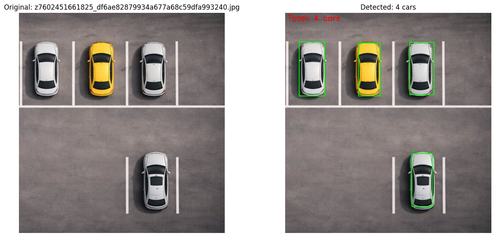

# Car Counting in Parking Lot without Deep Learning

## 1. Giới thiệu

Đây là project xử lý ảnh dùng **OpenCV** và các kỹ thuật **image processing truyền thống** để đếm số lượng xe trong ảnh bãi đỗ xe, **không sử dụng Deep Learning**.  
Mục tiêu của project là xây dựng một pipeline đơn giản, dễ hiểu, phù hợp với bài tập môn học về thị giác máy tính / xử lý ảnh.

Hệ thống nhận **ảnh đầu vào** và trả về:
- **Số lượng xe phát hiện được**
- **Ảnh kết quả** có vẽ bounding box quanh các xe hợp lệ
  
  
Phương pháp chính của project gồm:
- Tiền xử lý ảnh
- Phát hiện biên bằng Canny
- Phép toán hình thái học (morphology)
- Tạo mask vật thể
- Tách đối tượng bằng **Watershed Segmentation**
- Lọc vùng theo đặc trưng hình học để đếm xe

---

## 2. Mục tiêu bài toán

Bài toán yêu cầu:
1. Vẽ flowchart mô tả hệ thống đếm xe trong bãi đỗ xe.
2. Mô tả các bước trong hệ thống.
3. Xây dựng hàm nhận ảnh làm đầu vào và xuất ra số lượng xe.
4. Thử nghiệm với 5 ảnh và thảo luận kết quả.
5. Đề xuất cách cải thiện hệ thống.

Project này hiện thực đầy đủ các yêu cầu trên trong notebook `Count_car(1).ipynb`.

---

## 3. Ý tưởng chính của hệ thống

Thay vì học đặc trưng bằng mô hình học sâu, hệ thống này dựa trên giả định rằng:
- Xe có thể được tách ra khỏi nền thông qua biên và vùng khối
- Các xe trong ảnh bãi đỗ thường có hình dạng gần chữ nhật
- Sau khi tách vùng bằng watershed, có thể lọc các vùng đúng là xe bằng các tiêu chí hình học như:
  - diện tích
  - tỉ lệ khung bao
  - độ đầy vùng (extent)
  - số đỉnh đa giác xấp xỉ
  - circularity
  - rotated aspect ratio

Nhờ đó, hệ thống có thể đếm xe khá tốt trong các ảnh bãi đỗ đơn giản, góc nhìn từ trên cao, ánh sáng ổn định và ít chồng lấp.

---

## 4. Quy trình xử lý

Pipeline của hệ thống:

1. Đọc ảnh đầu vào  
2. Resize ảnh về chiều rộng cố định  
3. Chuyển sang ảnh xám  
4. Làm mượt bằng Gaussian Blur  
5. Phát hiện biên bằng Canny  
6. Thử nhiều kernel morphology closing khác nhau  
7. Chọn kết quả closing tốt nhất  
8. Tìm contour và tô đầy để tạo solid mask  
9. Tạo sure background bằng dilation  
10. Tạo sure foreground bằng distance transform + threshold  
11. Xác định vùng unknown  
12. Tạo marker bằng connected components  
13. Áp dụng watershed segmentation  
14. Trích từng vùng sau phân tách  
15. Lọc vùng bằng đặc trưng hình học  
16. Vẽ bounding box và đánh số xe  
17. Xuất tổng số xe

---

## 5. Flowchart

```text
Start
  |
  v
Read input image
  |
  v
Resize image to fixed width
  |
  v
Convert to grayscale
  |
  v
Apply Gaussian blur
  |
  v
Detect edges using Canny
  |
  v
Try multiple morphological closing kernels
  |
  v
Select best closing result
  |
  v
Find contours and fill them to create solid mask
  |
  v
Create sure background by dilation
  |
  v
Create sure foreground using distance transform
  |
  v
Compute unknown region
  |
  v
Connected components for markers
  |
  v
Apply watershed segmentation
  |
  v
Extract segmented regions
  |
  v
Filter regions by geometric rules
  |
  v
Count valid cars and draw bounding boxes
  |
  v
Output total number of cars
  |
  v
End
```

---

## 6. Mô tả chi tiết từng bước

### Bước 1. Đọc ảnh đầu vào
Hệ thống dùng `cv2.imread()` để đọc ảnh từ đường dẫn.  
Nếu ảnh không đọc được, hàm trả về `0` và dừng lại.

### Bước 2. Resize ảnh
Ảnh được resize về chiều rộng cố định là **800 pixels** để chuẩn hóa quá trình xử lý, giảm độ phức tạp tính toán và giúp các ngưỡng lọc ổn định hơn.

### Bước 3. Chuyển sang grayscale
Ảnh màu được chuyển sang ảnh xám bằng `cv2.cvtColor(..., cv2.COLOR_BGR2GRAY)` để đơn giản hóa dữ liệu đầu vào cho các bước phát hiện biên.

### Bước 4. Gaussian Blur
Dùng bộ lọc Gaussian `(5,5)` để làm mượt ảnh, giảm nhiễu và tránh tạo ra quá nhiều biên giả.

### Bước 5. Canny Edge Detection
Biên được phát hiện bằng thuật toán Canny.  
Thay vì dùng ngưỡng cố định, hệ thống tính ngưỡng dưới và trên dựa trên **median intensity** của ảnh sau blur:
- `lower = (1 - 0.33) * median`
- `upper = (1 + 0.33) * median`

Cách này giúp hệ thống thích nghi tốt hơn với các ảnh sáng tối khác nhau.

### Bước 6. Morphological Closing
Hệ thống thử nhiều kernel cho phép đóng biên bị đứt:
- Rect `(5,5)`
- Rect `(7,7)`
- Ellipse `(5,5)`
- Ellipse `(7,7)`

Mỗi trường hợp được đánh giá bằng số contour có diện tích lớn hơn ngưỡng. Kernel cho điểm tốt nhất sẽ được chọn.

### Bước 7. Tạo solid mask
Sau khi đóng biên, hệ thống tìm contour ngoài và tô đầy các contour có diện tích đủ lớn để tạo ra **solid mask** biểu diễn vùng vật thể.

### Bước 8. Tạo background và foreground chắc chắn
- **Sure background**: dùng dilation để mở rộng nền chắc chắn
- **Sure foreground**: dùng `distanceTransform()` rồi threshold để giữ phần lõi của vật thể

Điều này rất quan trọng cho watershed segmentation.

### Bước 9. Xác định unknown region
`unknown = sure_bg - sure_fg`  
Đây là vùng chưa chắc thuộc nền hay vật thể, sẽ được watershed xử lý.

### Bước 10. Connected Components
Các vùng foreground được gán nhãn bằng `connectedComponents()` để tạo marker ban đầu cho watershed.

### Bước 11. Watershed Segmentation
Thuật toán watershed phân tách các vùng đang dính nhau thành các đối tượng riêng biệt.  
Đây là bước cốt lõi giúp đếm được nhiều xe ngay cả khi chúng ở gần nhau.

### Bước 12. Lọc vùng theo đặc trưng hình học
Sau watershed, mỗi vùng được kiểm tra bằng nhiều tiêu chí:
- diện tích tối thiểu / tối đa
- chiều rộng và chiều cao khung bao
- aspect ratio
- extent
- số đỉnh đa giác xấp xỉ
- circularity
- rotated rectangle ratio

Chỉ những vùng thỏa điều kiện mới được xem là xe.

### Bước 13. Đếm và hiển thị kết quả
Mỗi vùng hợp lệ sẽ:
- tăng bộ đếm `car_count`
- được vẽ bounding box màu xanh
- gắn nhãn số thứ tự

Cuối cùng, ảnh kết quả sẽ hiển thị tổng số xe phát hiện được.

---

## 7. Cấu trúc project

```text
project/
│
├── Count_car(1).ipynb     # Notebook chính của project
├── README.md              # File mô tả project
└── dataset/               # Thư mục chứa ảnh test (gợi ý)
```

Trong notebook hiện tại, dữ liệu được tải từ Google Drive bằng `gdown` và đọc từ thư mục:

```python
folder_path = "/content/ảnh_bãi_đậu_xe"
```

---

## 8. Công nghệ sử dụng

- **Python 3**
- **OpenCV**
- **NumPy**
- **Matplotlib**
- **gdown** (để tải dữ liệu từ Google Drive trong notebook)

---

## 9. Cài đặt môi trường

### Cách 1: Cài nhanh bằng pip

```bash
pip install opencv-python numpy matplotlib gdown
```

### Cách 2: Nếu chạy trên Google Colab
Trong notebook đã có lệnh:

```python
!pip install -q gdown
!gdown --folder "https://drive.google.com/drive/folders/1EUfHjdNKBipU2WB9w5CDPMHS2pzwKkhG"
```

---

## 10. Hàm chính

Hàm chính của project:

```python
def count_car_watershed_safe_v3(image_path, debug=False):
```

### Input
- `image_path`: đường dẫn đến ảnh cần đếm xe
- `debug`: nếu `True`, hàm trả thêm dữ liệu trung gian

### Output
- Nếu `debug=False`:
  - `car_count`: số lượng xe
  - `output_img`: ảnh kết quả có bounding box

- Nếu `debug=True`:
  - `car_count`
  - `output_img`
  - `debug_data` gồm:
    - `gray`
    - `edges`
    - `closed`
    - `solid_mask`
    - `sure_fg`
    - `best_kernel`

---

## 11. Ví dụ sử dụng

### Đếm xe trong một ảnh

```python
count, result = count_car_watershed_safe_v3("car_01.jpg")
print("Number of cars:", count)
```

### Hiển thị kết quả

```python
result_rgb = cv2.cvtColor(result, cv2.COLOR_BGR2RGB)
plt.imshow(result_rgb)
plt.axis("off")
plt.title(f"Detected: {count} cars")
plt.show()
```

### Chạy cho toàn bộ thư mục ảnh

```python
folder_path = "/content/ảnh_bãi_đậu_xe"
valid_exts = (".jpg", ".jpeg", ".png", ".bmp", ".webp")

image_files = sorted([
    f for f in os.listdir(folder_path)
    if f.lower().endswith(valid_exts)
])

for img_name in image_files:
    image_path = os.path.join(folder_path, img_name)
    count, result = count_car_watershed_safe_v3(image_path)
    print(f"{img_name}: {count} cars")
```

---

## 12. Nguyên lý lọc xe

Sau watershed, chưa phải vùng nào cũng là xe. Vì vậy project dùng một số điều kiện lọc:

- **Area filter**: loại vùng quá nhỏ hoặc quá lớn
- **Bounding box filter**: loại vùng có kích thước bất thường
- **Aspect ratio**: xe thường không quá dài hoặc quá vuông
- **Extent**: kiểm tra mức độ lấp đầy của contour trong bounding box
- **Polygon vertices**: loại vùng quá đơn giản hoặc quá phức tạp
- **Circularity**: tránh các vùng quá tròn hoặc quá méo
- **Rotated rectangle ratio**: hỗ trợ nhận dạng xe ở nhiều hướng khác nhau

Những luật này giúp giảm false positive trong bối cảnh bãi đỗ xe.

---

## 13. Thực nghiệm

Project được thử nghiệm trên **5 ảnh bãi đỗ xe**.

### Kết quả ghi nhận trong notebook
- Hệ thống hoạt động tốt trên cả 5 ảnh
- Số lượng xe phát hiện được trùng với số lượng xe thực tế trong các ảnh test
- Kết quả cho thấy phương pháp có hiệu quả trong các cảnh đơn giản, xe tách biệt rõ và góc nhìn tương đối thuận lợi

### Nhận xét
Phương pháp này phù hợp khi:
- ảnh có góc nhìn từ trên xuống hoặc gần top-view
- nền ít nhiễu
- xe không bị che khuất quá nhiều
- ánh sáng tương đối ổn định

---

## 14. Ưu điểm

- Không cần huấn luyện mô hình
- Dễ cài đặt và dễ giải thích
- Phù hợp cho bài tập học thuật về xử lý ảnh truyền thống
- Chạy nhanh với ảnh đơn lẻ
- Có thể quan sát rõ từng bước trong pipeline

---

## 15. Hạn chế

Dù cho kết quả tốt trên bộ ảnh thử nghiệm, hệ thống vẫn có một số hạn chế:

- Nhạy với điều kiện ánh sáng, bóng đổ và độ tương phản
- Dễ giảm độ chính xác khi xe dính nhau nhiều
- Phụ thuộc vào góc chụp
- Các ngưỡng hình học đang được thiết kế thủ công
- Khó tổng quát hóa cho nhiều loại bãi đỗ và nhiều độ phân giải khác nhau

---

## 16. Hướng cải tiến

Dựa trên phần thảo luận trong notebook, hệ thống có thể cải thiện theo các hướng sau:

### 1. Cải thiện tiền xử lý
Áp dụng:
- Histogram Equalization
- CLAHE
- Shadow removal

để làm nổi bật biên xe trong điều kiện ánh sáng phức tạp.

### 2. Tối ưu morphology
Tự động chọn kernel dựa trên:
- độ phân giải ảnh
- kích thước xe ước lượng
- mật độ xe trong ảnh

### 3. Tối ưu distance transform threshold
Ngưỡng hiện tại có thể chưa phù hợp cho mọi ảnh. Có thể dùng chiến lược adaptive threshold hoặc heuristic theo kích thước vùng.

### 4. Cải thiện bộ lọc hình học
Thay vì dùng ngưỡng cố định, có thể:
- scale threshold theo kích thước ảnh
- học thống kê từ dữ liệu mẫu
- thêm nhiều descriptor hình dạng mạnh hơn

### 5. Kết hợp thông tin màu / texture
Một số trường hợp biên không rõ nhưng vùng màu của xe vẫn khác nền. Có thể kết hợp thêm segmentation theo màu.

### 6. Mở rộng sang video
Nếu áp dụng cho camera bãi xe, có thể dùng thêm:
- background subtraction
- object tracking
- temporal consistency

để đếm ổn định hơn qua nhiều frame.

### 7. Nâng cấp bằng học máy / học sâu
Dù project hiện tại không dùng Deep Learning, trong ứng dụng thực tế có thể so sánh hoặc nâng cấp bằng các mô hình như YOLO, Mask R-CNN hoặc DETR để tăng độ bền vững.


## 17. Kết luận

Project đã xây dựng thành công một hệ thống đếm xe trong bãi đỗ xe **không dùng Deep Learning** bằng các kỹ thuật xử lý ảnh truyền thống.  
Pipeline kết hợp giữa **Canny edge detection**, **morphological processing**, **contour filling**, **distance transform** và **watershed segmentation**, sau đó lọc đối tượng bằng các đặc trưng hình học để xác định xe.

Kết quả thử nghiệm trên 5 ảnh cho thấy hệ thống hoạt động tốt trong môi trường đơn giản và có thể đáp ứng đúng yêu cầu bài tập.  
Tuy nhiên, để dùng trong môi trường thực tế phức tạp hơn, hệ thống cần được cải tiến thêm ở khâu tiền xử lý, phân tách vùng và thích nghi ngưỡng.


